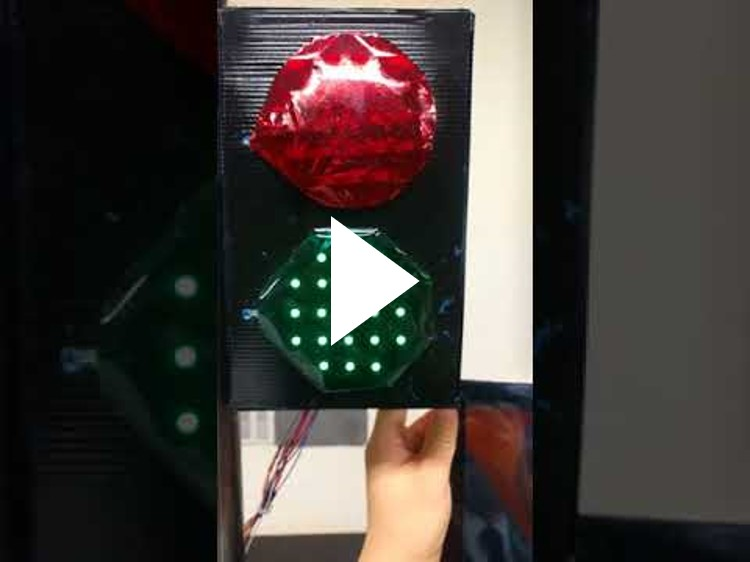

# Pedetector

2017 STEAM R&amp;E 출품작 - 보행자의 안정성을 고려하며 IT기술을 활용한 신호등 개선 방안

Pedetector는 보행자를 의미하는 Pedestrian과 보호기/보호자를 의미하는 Protector의 합성어로, 팀원들이 만들어낸 보행자를 보호하는 기기라는 의미를 갖는 합성어입니다.

# 팀원
> 유용민 : 팀장,  Android Appliication 프로그래밍, php Server 프로그래밍, FCM 계정 및 서버 관리

> 권승구 : Arduino 프로그래밍 보조, Hardware 디자인 보조

> 김성현 : Hardware 디자인 총괄

> 송준영 : Hardware 디자인 보조

> 장대현 : Arduino  프로그래밍 총괄

# Pedetector 프로젝트 진행 동기 : 설문조사

  

  

# Pedetector 프로젝트 동작 구조

## Pedetector Android Application

  

## Pedetector php Server

  

## Pedetector Arduino Device

  

## Pedetector 전체 프로젝트

  

# Pedetector 프로젝트 동작 영상

# Photos

  
  

  
  

  

